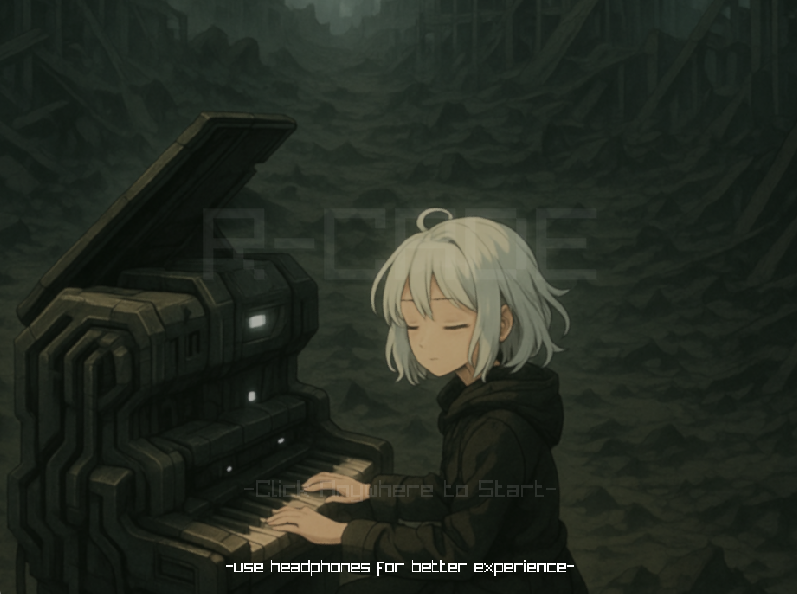
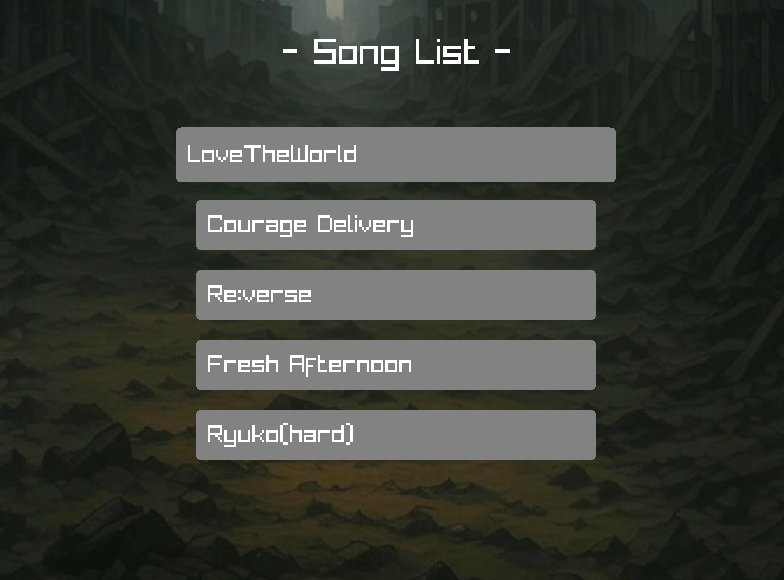
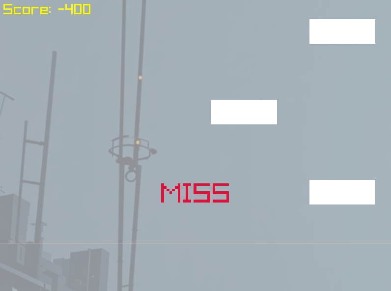

# RCade

> A four-lane rhythm game built with C++ and raylib, featuring five original songs and an ongoing performance investigation.

RCade began as an independently developed university course project and continues as a personal engineering project. Players use **A / S / D / F** to hit notes as they approach the judgment line.

## Gameplay

- Five original tracks with BPM-driven notes and randomly assigned lanes.
- Perfect, Good and Bad input judgments; unhit notes become Miss after their timing window expires.
- Intro, main menu, song selection, **3–2–1–GO**, gameplay and score screen.
- Press **Enter** on the score screen to return to the main menu.

| Song | BPM |
| --- | ---: |
| LoveTheWorld | 110 |
| Courage Delivery | 125 |
| Re:verse | 130 |
| Fresh Afternoon | 130 |
| Ryuko (Hard) | 180 |

## Quick Start — Windows

The project has been rebuilt with **MSYS2 MinGW64 GCC 14.2.0 and raylib 5.5**. Install a compatible toolchain and raylib development libraries before building. Binaries and runtime DLLs are not tracked in Git.

From PowerShell in the project root:

```powershell
.\build.ps1
.\Play.cmd
```

The script defaults to `C:\msys64\mingw64`. To use another compatible installation:

```powershell
.\build.ps1 -Toolchain 'C:\path\to\mingw64'
```

The build creates `build/music_game.exe` and copies matching runtime DLLs into `build/`. `Play.cmd` starts that executable with the project root as its working directory so `resources/` can be found.

On the author's local machine, the root-level `music_game.exe` has also been replaced with the updated build. Future builds update `build/`; use `Play.cmd` to run the latest compiled version.

## What Has Been Verified

| Item | Status |
| --- | --- |
| Default logging | Reduced to warnings and errors; `--verbose` restores detailed logging |
| Frame profiling | Optional in-memory collection with CSV export on normal exit |
| Build | Successfully rebuilt using the environment above |
| Statistics checks | Empty/single sample, percentile ordering and threshold boundaries passed |
| CLI validation | Invalid arguments rejected |
| Gameplay A/B comparison | **Not completed; no measured improvement is claimed** |

The author play-tested the updated game on September 23, 2026 and reported noticeably smoother gameplay. This is qualitative feedback, not a controlled A/B measurement; the size and cause of the improvement remain unverified. Full regression and audio checks remain pending.

## Compare Logging Modes

Run these launchers separately and play the same song under comparable conditions:

```powershell
.\Profile-Quiet.cmd
.\Profile-Verbose.cmd
```

Each launcher saves a CSV under `profiles/` after normal game exit, then displays the summary. Profiles are excluded from Git. For direct use from the project root:

```powershell
.\build\music_game.exe --profile quiet.csv
.\build\music_game.exe --verbose --profile verbose.csv
```

The summary reports mean, p95, p99, maximum frame time, and counts above 25/50 ms. Samples cover active gameplay loop iterations, including `EndDrawing()` and frame pacing. They are **not GPU completion timings or isolated CPU/GPU execution measurements**. Countdown and fade-out iterations are excluded; multiple songs in one run share the same dataset.

See [measurement procedure and limitations](docs/OPTIMIZATION.md). The logging hypothesis has not yet been confirmed by an actual A/B experiment.

## Project Layout

```text
RCade/
├── include/                 # Interfaces, state, constants, FrameProfile.h
├── src/                     # Game, Block, Input, Audio, Render, SongDatabase, main
├── resources/               # Music, images, sound effects and video files (flat layout)
├── tests/frame_profile_test.cpp
├── docs/
│   ├── DESIGN.md
│   └── OPTIMIZATION.md
├── build.ps1
├── Play.cmd
├── Profile-Quiet.cmd
├── Profile-Verbose.cmd
├── ASSETS.md
├── CHANGELOG.md
├── readme.pdf               # Original course-project document
└── README.md
```

[Technical design](docs/DESIGN.md) explains timing, input, audio and module responsibilities.

## Known Limitations and Next Steps

- Notes use BPM and random lanes rather than authored beatmaps.
- The current input chain processes only one lane per frame.
- Song offset, note travel time and device latency still need clearer separation and calibration.
- Menu update and rendering responsibilities remain intertwined; resource cleanup needs further work.
- Pause, retry, configurable controls and richer results are planned.
- Portable release packaging and more reproducible performance experiments remain future work.

The original source baseline is preserved by the `baseline-original` tag. Subsequent changes are recorded in [CHANGELOG.md](CHANGELOG.md).

## Authorship and Assets

- **Blank Tsai** — original course-project programming and system implementation.
- **VioletBK** — the five original songs, composed and produced by the author.
- Image assets were generated with AI assistance.
- Post-course AI assistance has included code analysis, documentation, optimization planning and implementation. Changes and verification results are recorded in Git history and the changelog.

See [ASSETS.md](ASSETS.md) for source details and outstanding asset information. No open-source license is granted; third-party dependencies retain their own licenses.

All rights reserved for the author's original contributions.

## Screenshots


### Main Menu



The opening menu introduces the game's visual style.

### Song Selection



Choose from five original songs with different BPM values.

### Gameplay



Use A / S / D / F to hit approaching notes. The capture shows the score and timing feedback during play.
